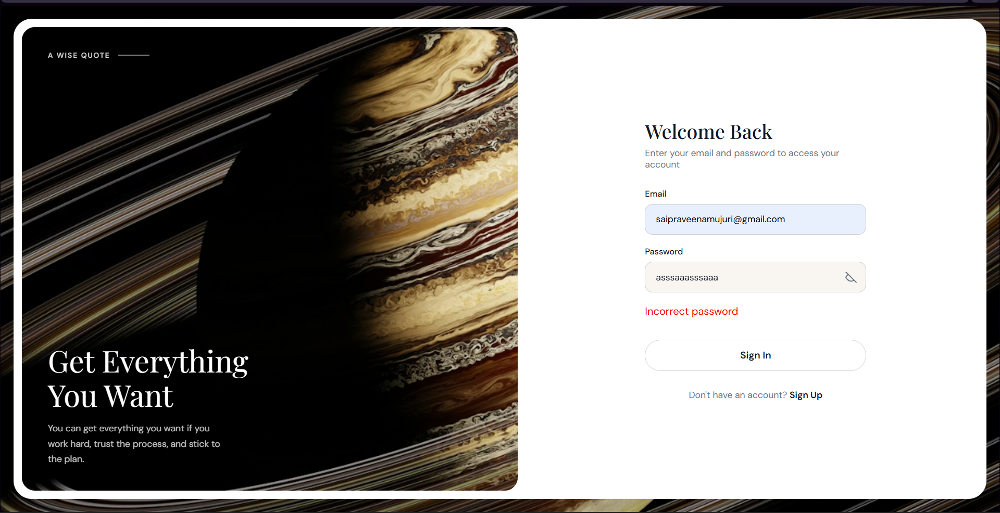
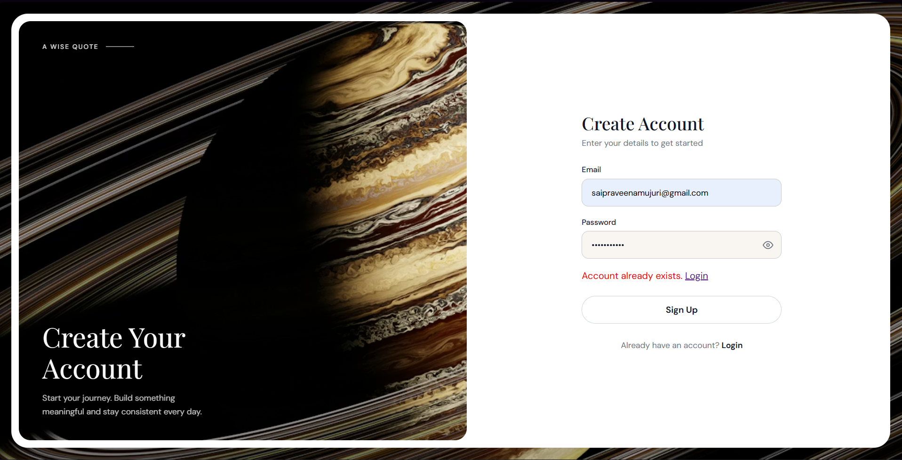

# PHP Login System with MySQL

This project is a secure and user-friendly login system built using PHP and MySQL. It includes authentication, registration, and session management with proper validation and security practices.

---

## 🚀 Features

- User Login & Signup system  
- Email and password validation (Client + Server side)  
- Secure password storage using `password_hash()`  
- SQL Injection prevention using prepared statements  
- Session-based authentication  
- Error handling with user-friendly messages  
- Dashboard access after successful login  

---

## 🛠️ Technologies Used

- HTML, CSS, JavaScript  
- PHP  
- MySQL  
- XAMPP (Apache Server)  

---

## 📂 Project Structure

```
php-login-system/
│
├── index.html
├── signup.html
├── auth.php
├── register.php
├── dashboard.php
├── logout.php
├── config.php
├── script.js
├── style.css
├── images/
│   ├── login.png
│   ├── signin.png
│   ├── dashboard.png
└── database.sql
```

---

## 🗄️ Database Setup

1. Open phpMyAdmin
2. Create a database (e.g., login_db)
3. Import database.sql
4. Update database credentials in config.php if needed

---

## ▶️ How to Run

1. Move project folder to:
   C:/xampp/htdocs/
2. Start Apache and MySQL in XAMPP  
3. Open:
   http://localhost/php-login-system/

---

## 📸 Demo

### 🔹 Login Page


### 🔹 Signup Page


### 🔹 Dashboard


---

## 🔐 Security Features

- Password hashing using password_hash()  
- Prepared statements to prevent SQL injection  
- Session management for authentication  
- Input validation on frontend and backend  

---

## 📚 Learnings

- Implemented complete authentication workflow  
- Learned PHP and MySQL integration  
- Applied security practices in real project  
- Improved understanding of validation and sessions  

---

## 📌 Conclusion

This project demonstrates a secure and practical implementation of a login system using PHP and MySQL.
